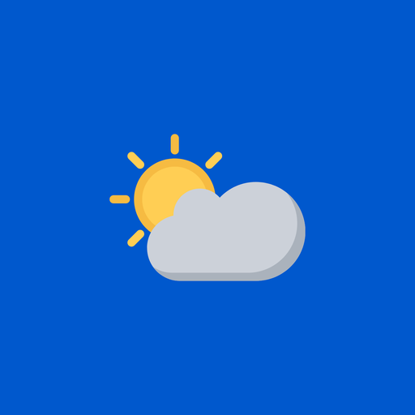
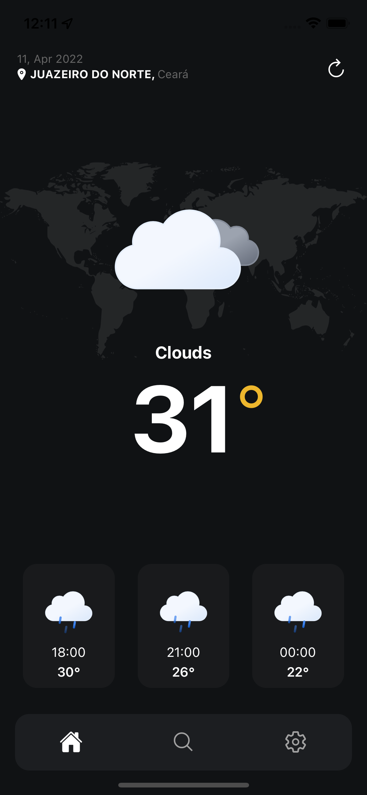
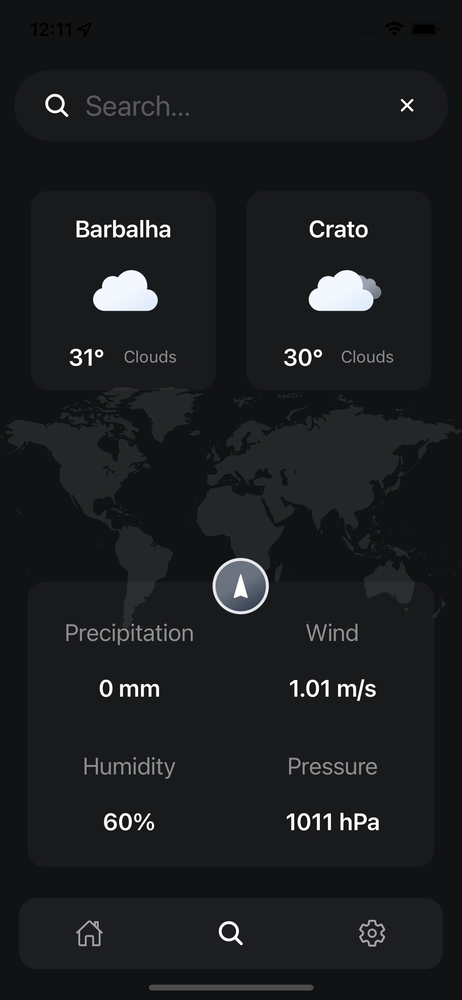
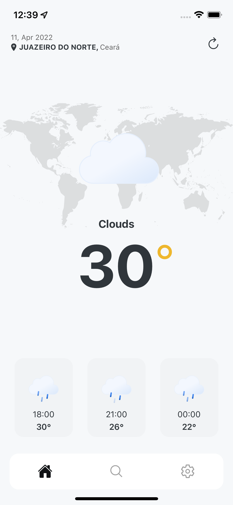
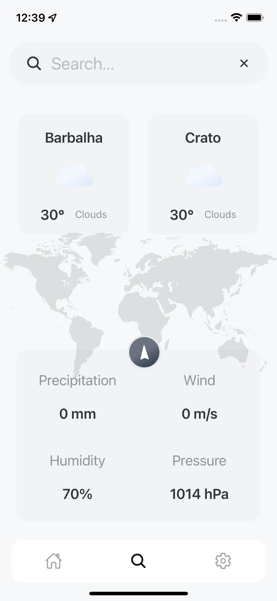

# 🌎 Weather


# 📸 Screenshots
<p align="center">
  
  
  
  
</p>

# 🚀 Getting Started

## Quick Start

To clone the project:

```sh
git clone git@github.com:gabrielferrado/weather-app.git
```

# 🎯 Step By Step Guide

## Clean-Up & Simple Run

- `yarn install`
- `npx pod-install`
- `yarn ios/andorid`

### Android local.properties (Android Only)

- `yarn install`
- `cd android && touch local.properties`
- `nano local.properties`

#### Example of MacOS Android SDK Path

Make sure that set your right path of Android **SDK**

##### MacOS / Linux

Replace your machine name instead of `username`

```
sdk.dir=/Users/username/Library/Android/sdk
```

##### Windows

Replace your machine name instead of `username`

```
sdk.dir=/Users/username/Library/Android/sdk
```

- `cd .. & yarn ios/android`

# 📃 Documentations

- [Components](./docs/components.md)
- [Project Structure](./docs/project-structure.md)


# 🔮 Roadmap

- [x] Implement default screens with custom tab bar
- [x] Implement OpenWeatherAPI methods using axios
- [x] Implement usage of dynamic animated icons
- [x] Implement geolocation method
- [x] Implement refresh button
- [x] Implement app-wide context
- [x] Implement forecast
- [x] Implement nearby cities weather conditions
- [ ] `Google Places API` Search component for locations
- [ ] Implement details for medium cards
- [ ] Implement infinite scroll for forecast
- [ ] `More Cities` button on search screen
- [ ] `Settings` screen

## License

Weather is available under the MIT license. See the LICENSE file for more info.
